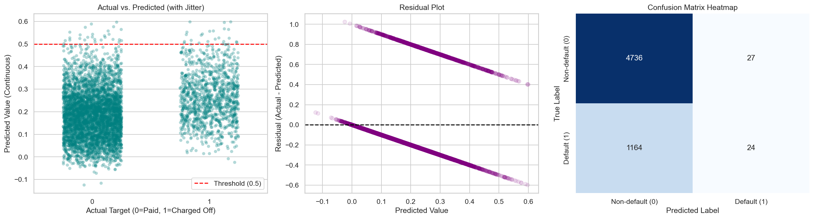

# <p align="center"><br>CrediFlux</p>

[](https://www.python.org/)
[](https://jupyter.org/)
[](https://opensource.org/licenses/MIT)

**CrediFlux** is an end-to-end Machine Learning project designed for **credit risk assessment** and **loan default prediction**. By leveraging historical peer-to-peer lending data from Lending Club, the system aims to analyze borrower profiles, financial indicators, and credit history to classify loan defaults and evaluate creditworthiness.

---

## 📂 Project Structure

The project follows a clean, modular structure:

```text
CrediFlux/
│
├── assets/
│   ├── crediflux_logo.svg                  # Project branding logo
│   ├── baseline_diagnostic_plots.png       # Combined 3-panel baseline diagnostic figure
│   ├── actual_vs_predicted.png             # Actual vs. Predicted strip plot
│   ├── residuals.png                       # Residual plot
│   └── confusion_matrix.png               # Confusion matrix heatmap
│
├── data/
│   ├── accepted_2007_to_2018Q4.csv         # Raw source dataset (~2.26M rows, locally stored)
│   └── crediflux_50k.csv                   # Stratified representative sample (50,000 rows)
│
├── notebooks/
│   ├── 01_create_50k_dataset.ipynb         # Dataset sampling and verification notebook
│   ├── 01_create_50k_dataset.md            # Notebook 01 documentation
│   ├── 02_linear_regression_baseline.ipynb # Simple Linear Regression baseline notebook
│   └── 02_linear_regression_baseline.md    # Notebook 02 documentation
│
├── scripts/
│   └── train_baseline.py                   # Standalone script: trains baseline model & saves plots
│
├── tests/
│   └── test_pipeline.py                    # Unit tests for dataset and baseline pipeline
│
├── .gitignore                              # Git exclusions (ignores raw dataset and caches)
└── README.md                               # Project documentation (this file)
```

---

## 🚀 Getting Started

### 1. Prerequisites
Ensure you have Python 3.13+ installed. Install the required data science packages:

```bash
pip install pandas numpy matplotlib seaborn scikit-learn jupyter
```

### 2. Dataset
The raw Lending Club dataset (`accepted_2007_to_2018Q4.csv`, ~1.67 GB) is **not** committed to this repository (excluded via `.gitignore`). Download it from Kaggle:

> **[Lending Club Loan Data — Kaggle](https://www.kaggle.com/datasets/wordsforthewise/lending-club)**

Place the downloaded CSV in the `data/` directory before running any notebooks or scripts.

The stratified 50 K sample (`data/crediflux_50k.csv`) **is** committed and ready to use.

### 3. Running the Notebooks
To execute the data sampling notebook and regenerate the 50K sample:

```bash
jupyter nbconvert --to notebook --execute --inplace notebooks/01_create_50k_dataset.ipynb
```

To execute the baseline Linear Regression model:

```bash
jupyter nbconvert --to notebook --execute --inplace notebooks/02_linear_regression_baseline.ipynb
```

### 4. Running the Standalone Baseline Script
Train the model and regenerate all diagnostic plots in `assets/` without Jupyter:

```bash
python scripts/train_baseline.py
```

### 5. Running Unit Tests
Validate dataset integrity and the baseline ML pipeline:

```bash
python -m unittest discover -s tests -v
```

All **9 tests** should pass.

---

## 📊 Mid-Semester Phase: Stratified Random Sampling

Because the full dataset is extremely large (~1.67 GB, 2.26 million rows), we generated a manageable yet highly representative working subset of **exactly 50,000 rows** for local development.

### 🔍 Sampling Strategy
To preserve the distribution of the highly imbalanced target column `loan_status` (which contains credit default and performance indicators), we implemented **Stratified Random Sampling** using scikit-learn.
* **Seed:** `random_state = 42` (ensures 100% reproducibility).
* **Memory Safety:** Streaming chunk-based pandas reading was used to prevent Out-Of-Memory (OOM) crashes on local environments.

### 📈 Representativeness Validation

#### Size Verification
* **Original Dataset:** 2,260,701 rows $\times$ 151 columns
* **Sampled Dataset:** 50,000 rows $\times$ 151 columns
* **Status:** Verified (`assert len(df_50k) == 50000`)

#### Target Distribution Comparison (`loan_status`)
The stratified sampling retains class percentages down to three decimal places:

| Category | Original Count | Original % | Sample Count | Sample % |
| :--- | :---: | :---: | :---: | :---: |
| **Fully Paid** | 1,076,751 | 47.629% | 23,814 | 47.628% |
| **Current** | 878,317 | 38.852% | 19,426 | 38.852% |
| **Charged Off** | 268,559 | 11.879% | 5,940 | 11.880% |
| **Late (31-120 days)** | 21,467 | 0.950% | 475 | 0.950% |
| **In Grace Period** | 8,436 | 0.373% | 186 | 0.372% |
| **Late (16-30 days)** | 4,349 | 0.192% | 96 | 0.192% |
| **Does not meet credit policy: Fully Paid** | 1,988 | 0.088% | 44 | 0.088% |
| **Does not meet credit policy: Charged Off** | 761 | 0.034% | 17 | 0.034% |
| **Default** | 40 | 0.002% | 1 | 0.002% |
| **Missing** | 33 | 0.001% | 1 | 0.002% |
---

## 📉 Mid-Semester Phase: Simple Linear Regression Baseline

We established an initial machine learning baseline using a simple **Linear Regression** model to predict credit default. The model serves as a benchmark and was trained on the 12 primary numerical features available at loan origination.

### 📊 Model Evaluation Summary

#### Regression Metrics
- **Mean Absolute Error (MAE):** 0.2952
- **Mean Squared Error (MSE):** 0.1469
- **Root Mean Squared Error (RMSE):** 0.3833
- **R² Score:** 0.0806 (8.1% variance explained)

#### Classification Metrics (Threshold = 0.5)
- **Accuracy:** 0.7999 (~80.0%)
- **Precision:** 0.4706 (~47.1%)
- **Recall:** 0.0202 (~2.0%)
- **F1-Score:** 0.0387 (~3.9%)

### 📈 Diagnostic Visualisations



### 💡 Baseline Interpretation
Applying Linear Regression to a binary classification task functions as a Linear Probability Model. However, due to class imbalance (~20% default rate), model outputs skew towards 0. A standard 0.5 threshold causes the model to classify almost all accounts as non-default, yielding high accuracy but an unusable **Recall of 2%**. This highlights the necessity of classification models (e.g., Logistic Regression or Random Forests) for the final credit risk pipeline.

---

## 🛠️ Roadmap & Future Phases

- [x] **Phase 1: Stratified Sampling & Validation**
  * Sample 50,000 representative records.
  * Verify target and numerical distribution similarity.
  * Establish reproducible seed structure.
- [x] **Phase 2: Simple Linear Regression Baseline**
  * Define target mapping (`Fully Paid` $\rightarrow$ 0, `Charged Off` $\rightarrow$ 1).
  * Feature scaling and median imputation.
  * Train and evaluate a baseline Linear Regression model.
  * Produce error visualizations and diagnostic plots.
- [ ] **Phase 3: Data Preprocessing, Cleaning & EDA**
  * Categorical feature encoding (One-Hot / Target encoding).
  * Outlier detection and treatment.
  * VIF multicollinearity checks and feature selection.
- [ ] **Phase 4: Advanced ML Model Training & Comparison**
  * Train **Logistic Regression** and **Random Forest** models.
  * Adjust decision thresholds to optimize Recall and F1-score.
